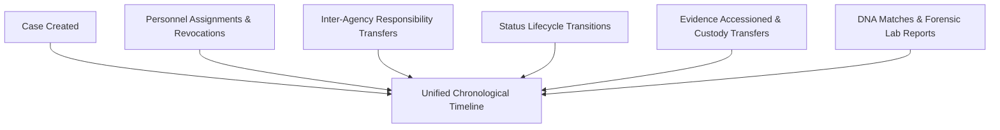

# KFIN — Case Forensic Audit & Historical Reconstruction Specification

**Document Reference:** `docs/cases/CASE-AUDIT.md`  
**Phase:** 1.3 — Core Domain & Case Management Foundation  
**System:** Kenya Forensic Intelligence Network (KFIN)  
**Status:** Canonical & Authoritative  

---

## 1. Forensic Audit Mandate & Evidence Act Compliance

In Kenyan criminal jurisprudence (under the Kenya Evidence Act, Cap 80, Sections 106A and 106B), electronic evidence must be accompanied by a verifiable certificate of integrity demonstrating that the recording computer system was operating properly and that records could not have been tampered with or retroactively altered.

To satisfy this legal evidentiary threshold, KFIN enforces:
1. **Append-Only Immutability:** Audit records in `audit_events` and historical status entries in `case_status_history` lack `updated_at` columns or update triggers.
2. **Cryptographic Actor Attribution:** Every mutation captures the authenticated user's ID, badge number, institutional code, client IP address, and correlation UUID.
3. **Structured Forensic Action Taxonomy:** Actions use strict enum values (`CASE_CREATE`, `CASE_UPDATE`, `CASE_STATUS_CHANGE`, `CASE_TRANSFER`, `CASE_ASSIGNMENT`, `ACCESS_DENIED`).
4. **Zero-PII Audit Sanitization:** Passwords, TOTP seeds, unencrypted national identity numbers, and raw STR allele matrices are strictly redacted before writing to audit logs.

---

## 2. Chronological Timeline Reconstruction

A primary feature of the KFIN Case aggregate is the ability to generate a comprehensive, unified **Chronological Timeline** (`GET /api/cases/:id/timeline`) by synthesizing across multiple domain event streams:

### Timeline Synthesis Query
The timeline is generated by aggregating chronological milestones:
1. **Case Registration:** Originating agency, initial priority, lead investigator.
2. **Assignments:** Officer badge numbers, assigned functional roles, revocation reasons.
3. **Transfers:** Relinquishing agency, receiving agency, transfer justification, statutory authorization references.
4. **Status Changes:** Previous state $\rightarrow$ next state, documented transition reason, authorizing officer.
5. **Journal Entries:** Timestamped investigative notes.

The synthesized timeline is ordered strictly chronologically (`ORDER BY timestamp ASC`), providing judges, defense counsel, and oversight bodies with a complete, tamper-evident narrative of the investigation from inception to trial.
