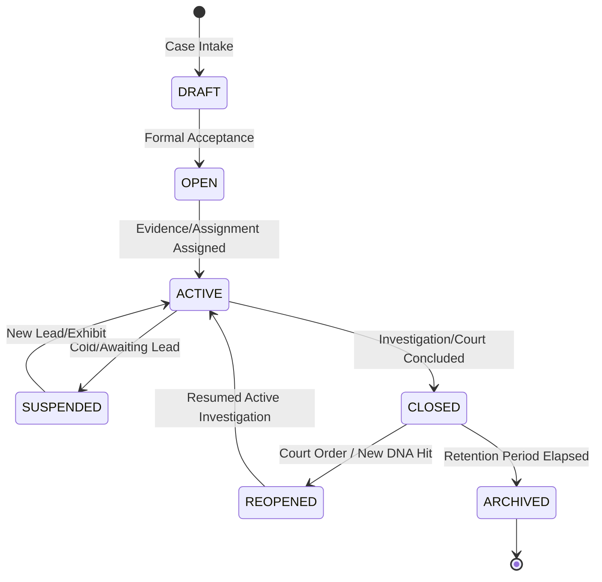

# KFIN — Case Lifecycle & Operational Progression

**Document Reference:** `docs/cases/CASE-LIFECYCLE.md`  
**Phase:** 1.3 — Core Domain & Case Management Foundation  
**System:** Kenya Forensic Intelligence Network (KFIN)  
**Status:** Canonical & Authoritative  

---

## 1. Case Lifecycle Stages

The lifecycle of an investigation in KFIN reflects the statutory realities of Kenyan criminal proceedings and forensic laboratory workflows:

### 1.1 DRAFT (Intake / Staging)
* **Definition:** Initial docket entry created by dispatch, front desk, or first responding officers.
* **Operational Scope:** Minimal preliminary details (e.g., suspected offense, initial county, provisional notes).
* **Allowed Transitions:** $\rightarrow$ `OPEN`
* **Forbidden Actions:** Cannot register formal evidence transfers, cannot request DNA matching, cannot be closed directly.

### 1.2 OPEN (Formalized Docket)
* **Definition:** The docket has been validated, assigned a unique Case Reference Number, and officially accepted by the originating agency.
* **Operational Scope:** Primary investigator assigned. Scene exhibits can now be formally accessioned into evidence vaults.
* **Allowed Transitions:** $\rightarrow$ `ACTIVE`, $\rightarrow$ `SUSPENDED`

### 1.3 ACTIVE (Operational Investigation)
* **Definition:** The case is actively investigated. Forensic exhibits are undergoing laboratory examination, biological samples are queued for STR profiling, and investigative notes are recorded.
* **Operational Scope:** Full operational capabilities. Secondary investigators, examiners, and analysts may be assigned.
* **Allowed Transitions:** $\rightarrow$ `SUSPENDED`, $\rightarrow$ `CLOSED`

### 1.4 SUSPENDED (Pending Leads / Inactive)
* **Definition:** Active investigative leads have been exhausted without resolution, or the case is pending statutory court scheduling.
* **Operational Scope:** Existing exhibits remain secured in evidence vaults. No active laboratory tasks are dispatched without supervisor approval.
* **Allowed Transitions:** $\rightarrow$ `ACTIVE`, $\rightarrow$ `CLOSED`

### 1.5 CLOSED (Concluded Docket)
* **Definition:** The investigation has concluded through judicial verdict, formal ODPP declination, or comprehensive exhaustion of forensic inquiries.
* **Operational Scope:** Read-only access for assigned personnel and auditors.
* **Mandatory Requirements:**
  * Must provide a documented `closure_reason`.
  * Cannot close if active laboratory examinations (`examination_stage != 'APPROVED'`) remain unresolved.
  * Cannot close if exhibits remain in intermediate transit (`status = 'IN_TRANSIT'`).
  * Cannot close if active legal holds exist.
* **Allowed Transitions:** $\rightarrow$ `REOPENED`, $\rightarrow$ `ARCHIVED`

### 1.6 REOPENED (Cold Case Review / Court Directive)
* **Definition:** A previously closed case is reopened due to novel forensic breakthroughs (e.g., CODIS DNA database cold hit), newly identified witnesses, or High Court directive.
* **Operational Scope:** Must record a formal `reopened_reason` and authorizing officer (`reopened_by_id`).
* **Allowed Transitions:** $\rightarrow$ `ACTIVE`

### 1.7 ARCHIVED (Permanent Preservation)
* **Definition:** Case records and evidentiary ledgers have met statutory retention thresholds and are permanently archived.
* **Operational Scope:** Terminal state. Strictly immutable; no further state transitions permitted.

---

## 2. Closure Precondition Protocols

Before a case can transition to `CLOSED`, the system verifies three mandatory operational guard conditions:

1. **Evidence Custody Verification:**
   All associated exhibits in `evidence_items` must be safely secured in a designated storage facility (`IN_VAULT`), formally returned (`DISPOSED`), or released by court order (`RELEASED`). Any item in `IN_TRANSIT` status blocks closure.
2. **Laboratory Examination Resolution:**
   No laboratory examination request associated with the case dockets may remain in an unresolved state (`PENDING`, `ACCEPTED`, `IN_ANALYSIS`, `TECHNICAL_REVIEW`, `ADMINISTRATIVE_REVIEW`). All requests must be finalized (`APPROVED`).
3. **Legal Hold Compliance:**
   If a statutory `legal_holds` directive is active against the case, closure is strictly prevented until an authorized officer dissolves the hold.

Violation of any closure precondition throws a `PreconditionFailedError` (HTTP 412).

---

## 3. Reopening Justification Protocol

Reopening a closed criminal case has significant constitutional implications under Kenya's Criminal Procedure Code (Cap 75) and Evidence Act (Cap 80). 

To ensure legal accountability:
1. Reopening is restricted to supervisory roles (`CASE_MANAGER`, `DIRECTOR_FORENSIC_SERVICES`, `ADMINISTRATOR`).
2. A detailed operational rationale (`reopened_reason`) is recorded.
3. An immutable audit record is logged with the authorizing officer's badge, timestamp, IP address, and correlation identifier.
4. The case transitions `CLOSED` $\rightarrow$ `REOPENED` and subsequently to `ACTIVE` upon assignment of investigative personnel. Direct jumps from `CLOSED` $\rightarrow$ `ACTIVE` are disallowed by the state machine to preserve this governance checkpoint.
