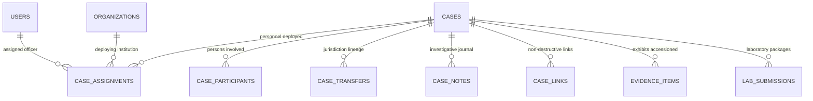

# KFIN — Case Relationships, Lineage & Entity Decoupling

**Document Reference:** `docs/cases/CASE-RELATIONSHIPS.md`  
**Phase:** 1.3 — Core Domain & Case Management Foundation  
**System:** Kenya Forensic Intelligence Network (KFIN)  
**Status:** Canonical & Authoritative  

---

## 1. Architectural Decoupling: Roster vs. Assigned Personnel

A critical architectural mandate of KFIN is the strict separation between:
1. **Persons Involved in the Incident (`case_participants`):** Victims, suspects, eyewitnesses, elimination subjects, and informants.
2. **Assigned State Personnel (`case_assignments`):** Law enforcement officers, crime scene investigators, evidence custodians, laboratory scientists, and prosecutors.

### Rationales for Separation:
* **Constitutional Rights & Privacy:** Persons of interest have rights under the Kenya Data Protection Act (2019) and Article 31 of the Constitution. Conflating them with police officers would corrupt identity records, role assignments, and access control models.
* **Separation of Duties:** Police officers investigating a homicide cannot simultaneously be recorded as suspects or witnesses in the same identity entity.
* **Auditability:** Assigned personnel possess system credentials, badge numbers, cryptographic tokens, and institutional permissions. Participants are external entities often represented via protective pseudonyms.

---

## 2. Personnel Assignments & Duty Separation (`case_assignments`)

Multi-agency forensic tasks require formal personnel assignments:
* Multiple officers from different institutions (e.g., DCI investigator + NPHL DNA analyst) can be assigned to the same case docket.
* Each assignment designates a specific `case_role` (`PRIMARY_INVESTIGATOR`, `CO_INVESTIGATOR`, `LEAD_ANALYST`, `EXAMINER`, `EVIDENCE_OFFICER`, `PROSECUTOR`, `CASE_MANAGER`).
* Each assignment designates an `access_scope` (`FULL_ACCESS`, `READ_ONLY`, `EVIDENCE_ONLY`, `REPORTS_ONLY`, `RESTRICTED_EXHIBIT`).
* **Non-Destructive Revocation:** When an officer is removed from a case, the record is not deleted. Instead, `is_active` is set to `false`, and `revoked_at` and `revocation_reason` are populated, maintaining an unbroken chain of operational responsibility.

---

## 3. Case Responsibility Transfers (`case_transfers`)

When a case is transferred from one agency to another (e.g., County Police Station to DCI Headquarters Homicide Section), or from one primary investigator to another:
1. The active `originating_org_id` and `lead_investigator_id` in the `cases` table are updated.
2. An immutable ledger row is written to `case_transfers` capturing:
   * `from_org_id` $\rightarrow$ `to_org_id`
   * `from_investigator_id` $\rightarrow$ `to_investigator_id`
   * `transfer_reason`
   * `authorization_reference` (e.g., judicial order or warrant number)
   * `notes`
   * `transferred_by_id` and `transferred_at`
3. This guarantees that historical responsibility can always be reconstructed during court testimony.

---

## 4. Cross-Case Linkages (`case_links`)

Criminal investigations frequently discover connections between seemingly disparate dockets (e.g., matching ballistic toolmarks, touch DNA matches across jurisdictions, or co-defendants).

KFIN implements **non-destructive cross-case linking**:
* Direct database merging of cases is strictly prohibited because each case docket holds distinct court filings, charge sheets, and jurisdictional responsibilities.
* Instead, `case_links` binds two dockets with a defined relationship:
  * `RELATED`: General associative link (e.g., common geographic area).
  * `DUPLICATE_CANDIDATE`: Potential duplicate dockets pending investigative reconciliation.
  * `CO_DEFENDANT`: Shared suspects across separate charge sheets.
  * `CROSS_JURISDICTIONAL`: Inter-county or international coordination.
  * `MERGED_REFERENCE`: Historical tracking link where one docket serves as reference.
* Each link requires a justifying note and records the authoring officer.
